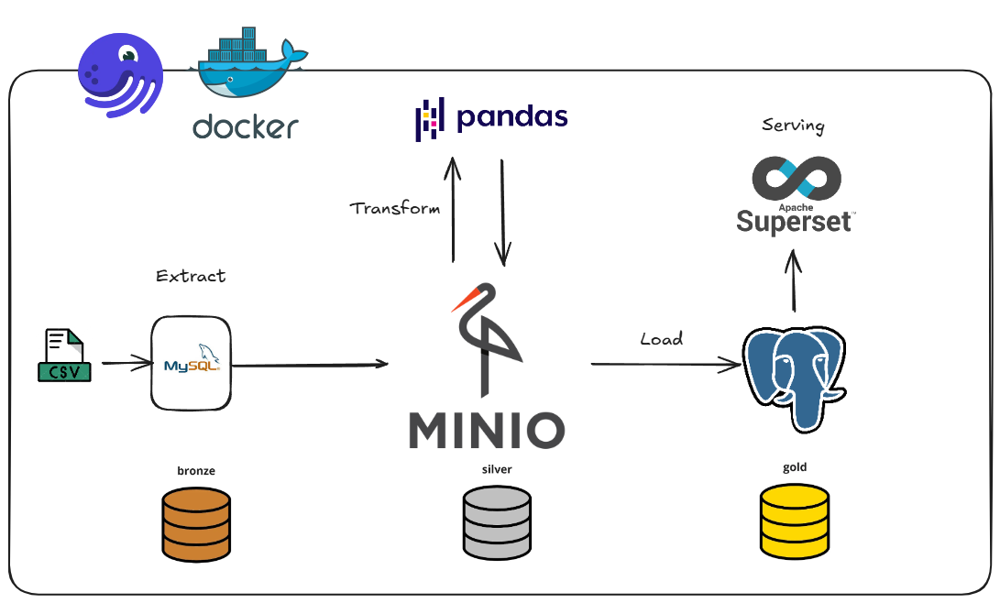

# 📊 Data Lakehouse Pipeline with MinIO, Pandas & Superset

The project implements a comprehensive, production-ready data engineering pipeline that transforms Brazilian e-commerce data into actionable business intelligence. Built with industry-standard practices and modern technologies, the system demonstrates a complete data lifecycle from ingestion to visualization.

This project applies knowledge from AIDE's "Fundamentals Data Engineering" course. Sincere thanks to Mr. Nguyen Thanh Binh and Mr. Hung Le for their guidance.



## Built With

- **[Docker](https://www.docker.com/)** - Containerizes each component of the pipeline, ensuring consistent environments and easy deployment.

- **[Dagster](https://dagster.io/)** - Orchestrates and schedules the end-to-end ETL workflows, from extraction through to loading.

- **[Pandas](https://pandas.pydata.org/)** - Handles in-memory data cleaning and transformation.

- **[MinIO](https://min.io/)** - Provides an S3-compatible object store for archiving raw and intermediate datasets.

- **[MySQL](https://www.mysql.com/)** - acts as the staging database where raw CSV data is first ingested.

- **[PostgreSQL](https://www.postgresql.org/)** - Serves as the Gold-layer data warehouse optimized for analytical queries.

- **[Apache Superset](https://superset.apache.org/)** - Offers an interactive BI interface for building dashboards and visualizing the data.

## Live Demo 

in progess :smile:


## Getting Started


### Prerequisites
- **Python 3.9+**  
- **Anaconda or Miniconda** for managing environments
### Setup

1. Clone repo and navigate to project directory
```bash  
git clone <repository-url>  
cd <project-folder>
```
2. Create and activate a new Anaconda environment:
```bash
conda create -n pyenv python=3.9+
conda activate pyenv
```
3. Build required Docker images
```bash
docker build -t de_dagster ./dagster/
docker build -t etl_pipeline:latest ./etl_pipeline
```
4. Start all services
```bash
docker-compose up -d
```

### Usage
1. 📥 Ingest Data into MySQL \\
Raw data is ingested from multiple CSV files and loaded into a MySQL database, serving as the system's initial staging layer.

2. 🔍 Transform Data with Pandas \
Leveraging the flexibility and power of Pandas, the raw datasets undergo cleansing, enrichment, and transformation to derive meaningful insights.

3. 🪣 Store Transformed Data in MinIO \
The processed data is serialized and stored in MinIO object storage as the silver layer, enabling scalable and cost-efficient data architecture.

4. 🏆 Load Gold-Layer Data into PostgreSQL \
High-quality, analysis-ready (gold layer) datasets are extracted from MinIO and loaded into a PostgreSQL database, ensuring efficient querying and analytics.

5. 📊 Visualize Insights with Apache Superset \
Finally, the gold-layer data is visualized using Apache Superset, allowing stakeholders to explore dashboards and make data-driven decisions.

6. 🔁 Orchestrate Workflow with Dagster \
Data workflows are orchestrated using Dagster, ensuring modular, maintainable, and observable pipelines with scheduled and event-driven triggers.


## 🤝 Contributing

Contributions, issues, and feature requests are welcome!


## Show your support

Give a ⭐️ if you like this project!


## 📝 License

This project is [MIT](./MIT.md) licensed.