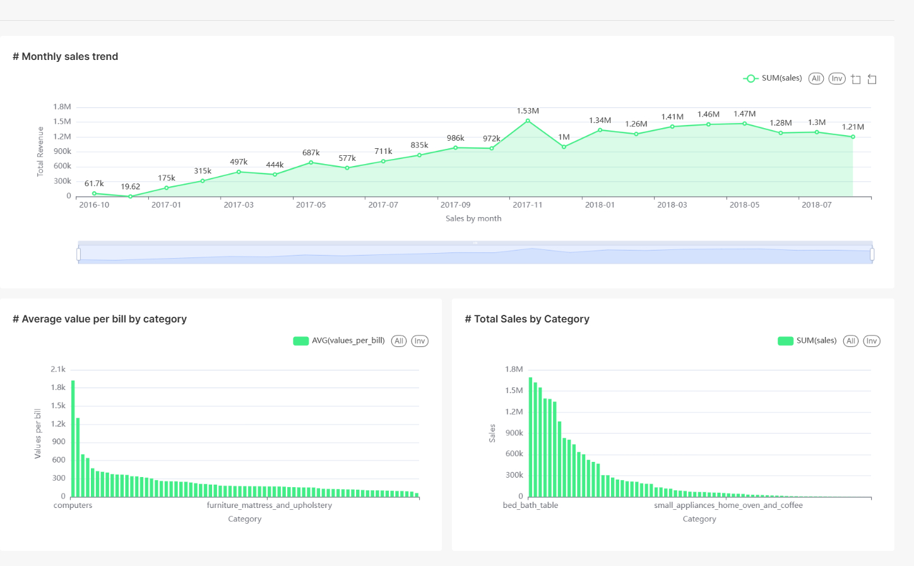

# 📊 Data Lakehouse Pipeline with MinIO, Pandas & Superset

The project implements a comprehensive, production-ready data engineering pipeline that transforms Brazilian e-commerce data into actionable business intelligence. Built with industry-standard practices and modern technologies, the system demonstrates a complete data lifecycle from ingestion to visualization.

This project applies knowledge from AIDE's "Fundamentals Data Engineering" course. Sincere thanks to Mr. Nguyen Thanh Binh and Mr. Hung Le for their guidance.


## Built With

- **[Docker](https://www.docker.com/)** - Containerizes each component of the pipeline, ensuring consistent environments and easy deployment.

- **[Dagster](https://dagster.io/)** - Orchestrates and schedules the end-to-end ETL workflows, from extraction through to loading.

- **[Pandas](https://pandas.pydata.org/)** - Handles in-memory data cleaning and transformation.

- **[MinIO](https://min.io/)** - Provides an S3-compatible object store for archiving raw and intermediate datasets.

- **[MySQL](https://www.mysql.com/)** - acts as the staging database where raw CSV data is first ingested.

- **[PostgreSQL](https://www.postgresql.org/)** - Serves as the Gold-layer data warehouse optimized for analytical queries.

- **[Apache Superset](https://superset.apache.org/)** - Offers an interactive BI interface for building dashboards and visualizing the data.

## Live Demo 

in progess :smile:


## Getting Started

**This is an example of how you may give instructions on setting up your project locally.**
**Modify this file to match your project, remove sections that don't apply. For example: delete the testing section if the currect project doesn't require testing.**


To get a local copy up and running follow these simple example steps.

### Prerequisites
- **Python 3.9+**  
- **Anaconda or Miniconda** for managing environments
### Setup

1. Clone repo and navigate to project directory
   ```bash  
   git clone <repository-url>  
   cd <project-folder>
   ```
2. Create and activate a new Anaconda environment:
   ```bash
   conda create -n pyenv python=3.9+
   conda activate pyenv
   ```
3. Build required Docker images
  ```bash
  docker build -t de_dagster ./dagster/
  docker build -t etl_pipeline:latest ./etl_pipeline
  ```
4. Start all services
  ```bash
  docker-compose up -d
  ```

### Usage
1. Load csv files to MySQL
2. Perform orchestration using Dagster
3. Transform the data using Pandas
4. Transformed data will be store in MinIO



## 🤝 Contributing

Contributions, issues, and feature requests are welcome!


## Show your support

Give a ⭐️ if you like this project!


## 📝 License

This project is [MIT](./MIT.md) licensed.